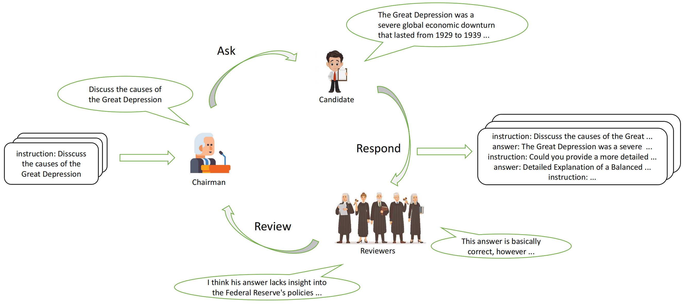

This is the repo for ACL2025 paper [Review-Instruct: A Review-Driven Multi-Turn Conversations Generation Method for Large Language Models](https://arxiv.org/abs/2505.11010).


## Review-Instruct

<p align="center">
  
</p>

Review-Instruct, a novel framework that synthesizes multi-turn conversations through an iterative "Ask-Respond-Review" process involving three agent roles: a Candidate, multiple Reviewers, and a Chairman. 
The framework iteratively refines instructions by incorporating Reviewer feedback, enhancing dialogue diversity and difficulty.

## How to use the repository to run code

Prepare the environment:
1. Set up the environment using: conda env create -f env.yml
2. Activate the environment with: conda activate LLM_Eval
3. Make sure you have the environment variables listed in utils/api_utils.py

Before including any participants, make sure:
1. The participant's calling function is written in the "generate_response" function inside "utils/api_utils.py".


here is an example command:

```bash
python main.py
```
## cite
```{bibliography}
@inproceedings{wu-etal-2025-review,
    title = "Review-Instruct: A Review-Driven Multi-Turn Conversations Generation Method for Large Language Models",
    author = "Wu, Jiangxu  and
      Wang, Cong  and
      Su, Tianhuang  and
      Haozhi, Lin  and
      JunYang, JunYang  and
      Zhangchao, Zhangchao  and
      Pan, Binqiang  and
      SongpanYang, SongpanYang  and
      Mingpeng, Mingpeng  and
      Shi, Kai  and
      Li, Zixian",
    booktitle = "Findings of the Association for Computational Linguistics: ACL 2025",
    month = jul,
    year = "2025",
    address = "Vienna, Austria",
    publisher = "Association for Computational Linguistics",
    url = "https://aclanthology.org/2025.findings-acl.851/",
    pages = "16578--16595",
    ISBN = "979-8-89176-256-5",
}
```
