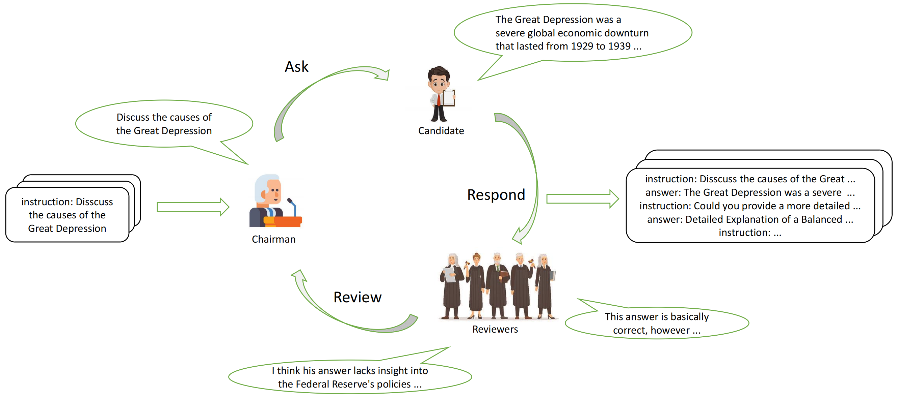

# Review-Instruct：用评审机制打造高质量多轮SFT数据｜ACL 2025论文解读

> 论文标题：Review-Instruct: A Review-Driven Multi-Turn Conversations Generation Method for Large Language Models  
> 机构：OPPO AI Center  
> 会议：ACL 2025  
> 核心创新：通过**多智能体评审框架**解决多轮对话数据生成的多样性与质量瓶颈

---
## 一、研究意义：多轮SFT数据的重要性
Llama3的技术报告中披露llama3在后训练阶段使用的SFT数据均为多轮形式，通用SFT数据平均轮数甚至达到6轮。多轮数据相比单轮数据在多样性、复杂性和困难度上明显更好，对于提升模型的推理和多轮对话能力有显著帮助。

  

## 二、问题背景：现有方法的局限
大型语言模型（LLM）在**多轮对话**中的表现常因训练数据缺陷受限：
- ❌ **单轮数据主导**：主流SFT数据多为独立指令-响应对，缺乏上下文连贯性
- ❌ **人工成本高**：人工标注多轮对话费时费力且涉及隐私问题
- ❌ **自动化方案不足**：传统"Ask-Respond"双智能体框架生成的指令**多样性低**且**难度有限**

---

## 三、Review-Instruct框架设计
创新性提出 **"Ask-Respond-Review"三阶段流程**，引入三类智能体角色：
| 角色        | 职责                                                                 | 关键技术策略                                  |
|-------------|----------------------------------------------------------------------|---------------------------------------------|
| **Chairman**  | 综合评审意见生成后续指令                                | 动态选择广度/深度演化： ✅ 正向反馈→**广度扩展**（提升多样性） ✅ 负面反馈→**深度追问**（提升难度） |
| **Candidate** | 响应指令生成答案                                        | 基于当前上下文生成自然回复                    |
| **Reviewers** | **多评审团**并行评估回答质量（相关性/连贯性/深度等） | 独立评审避免偏见，提供多维反馈                |

**流程示意图**：  

  

**Review-Instruct核心机制**：通过**三智能体动态评审循环**生成高质量多轮对话数据：  
1. **初始提问**：Chairman从单轮指令库（如Alpaca）选取问题，Candidate生成首轮响应；  
2. **多评审反馈**：多个Reviewer**并行评估**响应质量（相关性/深度/准确性），识别知识缺陷；  
3. **动态指令演化**：Chairman根据评审结果选择方向——  
   - ✅ **广度扩展**（正向反馈时横向延伸话题）  
   - ❌ **深度追问**（负面反馈时纵向挖掘弱点）；  
4. **闭环迭代**：新指令触发下一轮响应-评审流程，将单轮指令转化为**连贯多轮对话树**，提升数据多样性（+18.6%）与难度（+33.4%困难指令）。

---

## 四、关键实验结果
在**LLaMA2-13B**基座模型上验证，使用Alpaca数据集生成多轮数据：

### 1. 主流评测指标显著提升
| 模型                 | MT-Bench (Overall) | MMLU-Pro (Acc) | 提升幅度 |
|----------------------|---------------------|----------------|----------|
| LLaMA2-13B-Chat      | 6.65                | 25.34%         | -        |
| WizardLM-13B-V1.2    | 7.06                | 26.75%         | -        |
| **Review-Instruct-13b** | **7.20**            | **29.65%**     | **+2.9% (MMLU-Pro)** **+2.0% (MT-Bench)** |

> ✅ **Auto-Arena评测**（GPT-4o作为裁判）：  
> 在80条人工对比评估中显著优于基线模型（例如对WizardLM胜率72.5%）

### 2. 消融实验验证核心设计
| 对比模型                     | MMLU-Pro | 关键结论 |
|------------------------------|----------|----------|
| 单轮对话数据训练             | 19.3%    | 多轮结构提升知识连贯性 |
| 移除Review阶段               | 22.9%    | **Review机制贡献核心增益** |
| 单Reviewer vs 多Reviewer     | 26.7% → 29.65% | 多评审提升指令多样性 |

---

## 五、数据质量分析
评审机制对生成指令的**多样性**和**难度**有显著改善：
### 1. 指令难度提升（GPT-4o评估）
- 相比无Review方法：**困难指令比例↑33.4%**
- 相比单Reviewer方法：**困难指令比例↑19.6%**  

  

### 2. 指令多样性提升（Instagger标签分析）
- 相比无Review方法：**新标签比例↑18.6%**
- 相比单Reviewer方法：**新标签比例↑7.5%**  

  

## 六、总结
Review-Instruct通过引入**多智能体评审闭环机制**，实现了单轮指令到高质量多轮对话的动态演化：  
1. **创新性**：首创"Ask-Respond-Review"三阶段框架，以**动态反馈驱动指令进化**；  
2. **有效性**：显著提升指令难度（+33.4%）与多样性（+18.6%），刷新13B模型SOTA指标；  
3. **普适性**：为低成本生成**上下文连贯、知识深度递进**的多轮对话数据提供开创性解决方案。